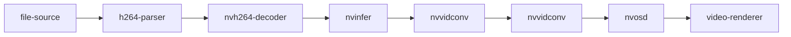

{}
本文承接[上文](https://blog.csdn.net/leida_wt/article/details/112181863)，记录对英伟达DeepStream python接口的初步探索。


DeepStream-Python使用Gst-Python API操作构建操作管线（pipeline），并使用探针函数（probe）访问管线中各个点的数据。本文主要参考[官方例程](https://docs.nvidia.com/metropolis/deepstream/dev-guide/text/DS_Python_Sample_Apps.html)简要介绍DeepStream-Python的使用方法。
# GStreamer参考阅读
DeepStream-Python接口依赖GStreamer的python接口建立和操作GStreamer管线，并提供python包pyds提供访问GStreamer metadata的一些接口函数。GStreamer和Gst-Python的相关信息可通过下面的链接进行了解。
[GStreamer系列之几个入门概念](https://thebigdoc.readthedocs.io/en/latest/gstreamer/gst-concept.html)
[Python Gstreamer入门-学习笔记](https://blog.csdn.net/qq_32188669/article/details/95185731)
[视音频编解码技术零基础学习方法](https://blog.csdn.net/leixiaohua1020/article/details/18893769#commentBox)
[GStreamer文档翻译](https://blog.csdn.net/sakulafly/category_1819383.html)

# DeepStream-Python例程
官方例程[DeepStream Python Apps](https://github.com/NVIDIA-AI-IOT/deepstream_python_apps)包含如下内容：
- deepstream-test1 -- 4-class object detection pipeline
- deepstream-test2 -- 4-class object detection, tracking and attribute classification pipeline
- deepstream-test3 -- multi-stream pipeline performing 4-class object detection
- deepstream-test4 -- msgbroker for sending analytics results to the cloud
- deepstream-imagedata-multistream -- multi-stream pipeline with access to image buffers
- deepstream-ssd-parser -- SSD model inference via Triton server with output parsing in Python
- deepstream-test1-usbcam -- deepstream-test1 pipeline with USB camera input
- deepstream-test1-rtsp-out -- deepstream-test1 pipeline with RTSP output

为运行DeepStream-Python例程，我们使用nvcr.io/nvidia/deepstream:5.0.1-20.09-samples镜像。该镜像提供SeepStream环境，同时还囊括了示例程序所需使用的模型和测试视频，但不包括python例程仓库。
将例程仓库克隆到xxx/tlt-python/deepstream_python_apps，执行下面命令启动进入镜像：
```bash
xhost +
docker run --rm --gpus all --name ds_python_test --device=/dev/video0 -it -p 8554:8554  -v /tmp/.X11-unix:/tmp/.X11-unix -e DISPLAY=:0 -v "xxx/tlt-python/deepstream_python_apps":"/opt/nvidia/deepstream/deepstream-5.0/sources/deepstream_python_apps/" -w /opt/nvidia/deepstream/deepstream-5.0/sources/deepstream_python_apps/apps/ nvcr.io/nvidia/deepstream:5.0.1-20.09-samples /bin/bash
```
参数解释：
- gpus all 指定容器可见的GPU
- device=/dev/video0 将摄像头0映射进入容器
- -p 8554:8554 映射RTSPStreaming RTSP端口（可选）
- -v /tmp/.X11-unix:/tmp/.X11-unix -e DISPLAY=:0 连接图形界面到宿主机
- -v "xxx/tlt-python/deepstream_python_apps":"/opt/nvidia/deepstream/deepstream-5.0/sources/deepstream_python_apps/" 映射例程仓库
- -w /opt/nvidia/deepstream/deepstream-5.0/sources/deepstream_python_apps/apps/设置进入容器后开启的路径

进入镜像后，我们安装所需依赖包：

```bash
apt install nano
rm /etc/apt/sources.list
touch /etc/apt/sources.list
# 换清华源
echo "deb https://mirrors.tuna.tsinghua.edu.cn/ubuntu/ bionic main restricted universe multiverse" >>/etc/apt/sources.list
echo "deb https://mirrors.tuna.tsinghua.edu.cn/ubuntu/ bionic-updates main restricted universe multiverse" >>/etc/apt/sources.list
echo "deb https://mirrors.tuna.tsinghua.edu.cn/ubuntu/ bionic-backports main restricted universe multiverse" >>/etc/apt/sources.list
echo "deb https://mirrors.tuna.tsinghua.edu.cn/ubuntu/ bionic-security main restricted universe multiverse" >>/etc/apt/sources.list
apt update
# gst-python依赖
apt install python3-gi python3-dev python3-gst-1.0 -y
# 部分demo的依赖
# apt install python3-opencv  -y
# apt install python3-numpy -y

# RTSP依赖
apt install libgstrtspserver-1.0-0 gstreamer1.0-rtsp -y
apt install libgirepository1.0-dev -y
apt install gobject-introspection gir1.2-gst-rtsp-server-1.0 -y

# 安装pyds，该包用于取GSt pipeline的metadata(包含类标号、置信度等检测信息)
cd /opt/nvidia/deepstream/deepstream/lib
python3 setup.py install

# python-demo root: /opt/nvidia/deepstream/deepstream-5.0/sources/deepstream_python_apps/apps/
# run rtsp-demo :
# cd /opt/nvidia/deepstream/deepstream-5.0/sources/deepstream_python_apps/apps/deepstream-test1-rtsp-out
# python3 deepstream_test1_rtsp_out.py -i ../../../../samples/streams/sample_720p.h264

```
## test1-rtsp-out：构建一个4类检测流水线
该程序对输入的视频进行解码并送入一个4-class目标检测网络，渲染检测结果，最后进行编码并推送RTSP流：

注意此处解析器（h264-parser）和解码器（nvh264-decoder）的区别，解析器获取字节流并将其转换为内存中的表示形式，但不将字节转换为像素。解析器可以读取分辨率，编码参数，帧的开始和结束位置等信息。此外，该程序仅支持输入h264或h265编码的视频流文件，而无法对mp4这类封装格式进行解包，如需输入mp4这类音视频封装格式，可使用qtdemux分离视频流。qtdemux插件使用示例可在[这里](https://docs.nvidia.com/metropolis/deepstream/dev-guide/text/DS_FAQ.html#how-can-i-construct-the-deepstream-gstreamer-pipeline)找到。

对镜像中的示例视频流文件sample_720p.h264进行检测：
```bash
python3 deepstream_test1_rtsp_out.py -i ../../../../samples/streams/sample_720p.h264
```
使用Potplayer等播放器访问地址：
```bash
 rtsp://<server IP>:8554/ds-test
 ```
 即可查看实时的检测结果，下面我们查阅其源码deepstream_test1_rtsp_out.py简要分析其实现流程。
 
首先引入必要的包：
```python
import gi
gi.require_version('Gst', '1.0')
gi.require_version('GstRtspServer', '1.0')
from gi.repository import GObject, Gst, GstRtspServer
from common.is_aarch_64 import is_aarch64
from common.bus_call import bus_call
import pyds
```
其中gi是PyGObject包，它为基于GObject的库（例如GTK，GStreamer，W​​ebKitGTK，GLib，GIO等）提供python接口。pyds是用于访问GStreamer metadata的包，bus_call和is_aarch64是两个util，分别用于总线回调和cpu体系结构判断。
随后，在main函数中，初始化GStreamer并实例化构建pipeline所需的GStreamer元素。
```python
# Standard GStreamer initialization
GObject.threads_init()
Gst.init(None)

# Create gstreamer elements
# Create Pipeline element that will form a connection of other elements
print("Creating Pipeline \n ")
pipeline = Gst.Pipeline()
if not pipeline:
    sys.stderr.write(" Unable to create Pipeline \n")
```
添加gstreamer提供的filesrc和h264parse组件，这两个组件完成.h264文件读取和解析工作。
```python
# Source element for reading from the file
print("Creating Source \n ")
source = Gst.ElementFactory.make("filesrc", "file-source")
if not source:
    sys.stderr.write(" Unable to create Source \n")

# Since the data format in the input file is elementary h264 stream,
# we need a h264parser
print("Creating H264Parser \n")
h264parser = Gst.ElementFactory.make("h264parse", "h264-parser")
if not h264parser:
    sys.stderr.write(" Unable to create h264 parser \n")
```
添加nvidia提供的NV解码器，该解码器调用GPU解码器进行解码，效率很高。其他GPU解码器详见[这里](https://docs.nvidia.com/jetson/l4t/index.html#page/Tegra%20Linux%20Driver%20Package%20Development%20Guide/accelerated_gstreamer.html)。
```python
# Use nvdec_h264 for hardware accelerated decode on GPU
print("Creating Decoder \n")
decoder = Gst.ElementFactory.make("nvv4l2decoder", "nvv4l2-decoder")
if not decoder:
    sys.stderr.write(" Unable to create Nvv4l2 Decoder \n")
```
添加deepstream提供的nvstreammux插件，该插件是功能是聚合多个视频流，组成batch，以便被随后的推理模块处理。

```python
# Create nvstreammux instance to form batches from one or more sources.
streammux = Gst.ElementFactory.make("nvstreammux", "Stream-muxer")
if not streammux:
    sys.stderr.write(" Unable to create NvStreamMux \n")
```
添加检测器，nvinfer插件使用TensorRT对输入数据进行推断。该插件参数很多，通过配置文件导入，配置文件路径通过config-file-path参数指定（见后文）。
```python
# Use nvinfer to run inferencing on decoder's output,
# behaviour of inferencing is set through config file
pgie = Gst.ElementFactory.make("nvinfer", "primary-inference")
if not pgie:
    sys.stderr.write(" Unable to create pgie \n")
```
添加可视化渲染模块nvdsosd，该模块接收RGBA格式，故还需加两个转换器。由于是进行帧格式转换，故这两个转换器的开销很小。转换器会根据其前后模块的Cap类型（消息类型）自动转换，不需手动指定转换方式。

```python
# Use convertor to convert from NV12 to RGBA as required by nvosd
nvvidconv = Gst.ElementFactory.make("nvvideoconvert", "convertor")
if not nvvidconv:
    sys.stderr.write(" Unable to create nvvidconv \n")

# Create OSD to draw on the converted RGBA buffer
nvosd = Gst.ElementFactory.make("nvdsosd", "onscreendisplay")
if not nvosd:
    sys.stderr.write(" Unable to create nvosd \n")
nvvidconv_postosd = Gst.ElementFactory.make("nvvideoconvert", "convertor_postosd")
if not nvvidconv_postosd:
    sys.stderr.write(" Unable to create nvvidconv_postosd \n")
```
下面两个插件用于编码渲染好帧检测结果的原始视频流。其中capsfilter插件用于初步数据压缩，从原始的帧格式转化为h264编码器所要求的I420格式。详见[这里](https://blog.csdn.net/leixiaohua1020/article/details/12234821)。编码后，使用rtph264pay插件将编码视频打包成RTP包，以便使用RTSP推流。
```python
# Create a caps filter
caps = Gst.ElementFactory.make("capsfilter", "filter")
caps.set_property("caps", Gst.Caps.from_string("video/x-raw(memory:NVMM), format=I420"))

# Make the encoder
if codec == "H264":
    encoder = Gst.ElementFactory.make("nvv4l2h264enc", "encoder")
    print("Creating H264 Encoder")
elif codec == "H265":
    encoder = Gst.ElementFactory.make("nvv4l2h265enc", "encoder")
    print("Creating H265 Encoder")
if not encoder:
    sys.stderr.write(" Unable to create encoder")
encoder.set_property('bitrate', bitrate)
if is_aarch64():
    encoder.set_property('preset-level', 1)
    encoder.set_property('insert-sps-pps', 1)
    encoder.set_property('bufapi-version', 1)

# Make the payload-encode video into RTP packets
if codec == "H264":
    rtppay = Gst.ElementFactory.make("rtph264pay", "rtppay")
    print("Creating H264 rtppay")
elif codec == "H265":
    rtppay = Gst.ElementFactory.make("rtph265pay", "rtppay")
    print("Creating H265 rtppay")
if not rtppay:
    sys.stderr.write(" Unable to create rtppay")
```
添加udpsink。udpsink是一个网络接收器，它将UDP数据包发送到网络。 它可以与RTP有效负载结合使用以实现RTP流。
```python
# Make the UDP sink
updsink_port_num = 5400
sink = Gst.ElementFactory.make("udpsink", "udpsink")
if not sink:
    sys.stderr.write(" Unable to create udpsink")

sink.set_property('host', '224.224.255.255')
sink.set_property('port', updsink_port_num)
sink.set_property('async', False)
sink.set_property('sync', 1)

print("Playing file %s " %stream_path)
source.set_property('location', stream_path)
streammux.set_property('width', 1920)
streammux.set_property('height', 1080)
streammux.set_property('batch-size', 1)
streammux.set_property('batched-push-timeout', 4000000)
```
至此所有插件均以实例化，下面的代码将其添加到处理管线，并指定插件之间的连接关系
```python
pgie.set_property('config-file-path', "dstest1_pgie_config.txt")

print("Adding elements to Pipeline \n")
pipeline.add(source)
pipeline.add(h264parser)
pipeline.add(decoder)
pipeline.add(streammux)
pipeline.add(pgie)
pipeline.add(nvvidconv)
pipeline.add(nvosd)
pipeline.add(nvvidconv_postosd)
pipeline.add(caps)
pipeline.add(encoder)
pipeline.add(rtppay)
pipeline.add(sink)

# Link the elements together:
# file-source -> h264-parser -> nvh264-decoder ->
# nvinfer -> nvvidconv -> nvosd -> nvvidconv_postosd -> 
# caps -> encoder -> rtppay -> udpsink

print("Linking elements in the Pipeline \n")
source.link(h264parser)
h264parser.link(decoder)
sinkpad = streammux.get_request_pad("sink_0")
if not sinkpad:
    sys.stderr.write(" Unable to get the sink pad of streammux \n")

srcpad = decoder.get_static_pad("src")
if not srcpad:
    sys.stderr.write(" Unable to get source pad of decoder \n")

srcpad.link(sinkpad)
streammux.link(pgie)
pgie.link(nvvidconv)
nvvidconv.link(nvosd)
nvosd.link(nvvidconv_postosd)
nvvidconv_postosd.link(caps)
caps.link(encoder)
encoder.link(rtppay)
rtppay.link(sink)
```
创建Gst事件循环，在bus上挂载回调函数bus_call。bus_call的功能是将bus上的消息打印到命令行。
```python
# create an event loop and feed gstreamer bus mesages to it
loop = GObject.MainLoop()
bus = pipeline.get_bus()
bus.add_signal_watch()
bus.connect ("message", bus_call, loop)
```
启动RTSP服务端
```python
# Start streaming
rtsp_port_num = 8554

server = GstRtspServer.RTSPServer.new()
server.props.service = "%d" % rtsp_port_num
server.attach(None)

factory = GstRtspServer.RTSPMediaFactory.new()
factory.set_launch( "( udpsrc name=pay0 port=%d buffer-size=524288 caps=\"application/x-rtp, media=video, clock-rate=90000, encoding-name=(string)%s, payload=96 \" )" % (updsink_port_num, codec))
factory.set_shared(True)
server.get_mount_points().add_factory("/ds-test", factory)

print("\n *** DeepStream: Launched RTSP Streaming at rtsp://localhost:%d/ds-test ***\n\n" % rtsp_port_num)
```
添加buffer探针，获取检测的metadata。探针挂载在可视化插件是输入缓冲上（即推理模块的输出缓冲），以获得包含有检测结果的metadata。具体实现逻辑在osd_sink_pad_buffer_probe函数中给出。这一函数十分重要，为我们提供了访问检测信息的python接口。
```python
# Lets add probe to get informed of the meta data generated, we add probe to
# the sink pad of the osd element, since by that time, the buffer would have
# had got all the metadata.
osdsinkpad = nvosd.get_static_pad("sink")
if not osdsinkpad:
    sys.stderr.write(" Unable to get sink pad of nvosd \n")

osdsinkpad.add_probe(Gst.PadProbeType.BUFFER, osd_sink_pad_buffer_probe, 0)
```
buffer的数据结构的层次关系如下所示。

在main函数的最后，启动整个pipeline。
```python
# start play back and listen to events
print("Starting pipeline \n")
pipeline.set_state(Gst.State.PLAYING)
try:
    loop.run()
except:
    pass
# cleanup
pipeline.set_state(Gst.State.NULL)
```
程序的最后，处理命令行传参并调用main函数。
```python
if __name__ == '__main__':
    parse_args()
    sys.exit(main(sys.argv))
```
注意sys.exit的使用，该函数可以呈递main的异常代码以便进行一些后处理工作，完整的使用sys.exit函数的逻辑应该是如下这样的[代码](https://www.pynote.net/archives/1036)：
```python
import sys

def main():
    sys.exit(123)
    return

if __name__ == '__main__':
    try:
        main()
    except SystemExit as e:
        if str(e) == '123':
            print('---123---')
            exit(123)
```

# 总结
使用python构建DeepStream应用的基本思路是使用Gst-python API构建pipeline，并通过pyds提供的接口函数编写探针函数实现通过python读取和访问pipeline信息。
