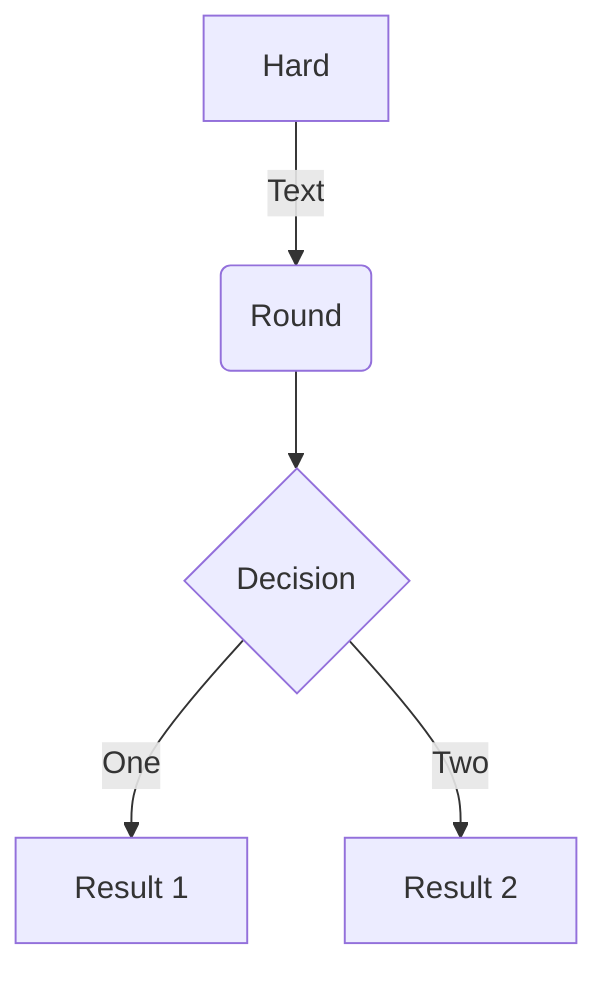
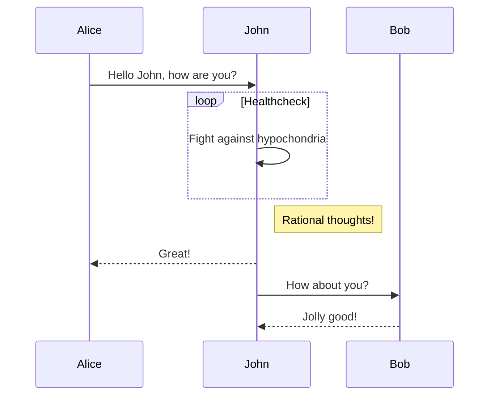
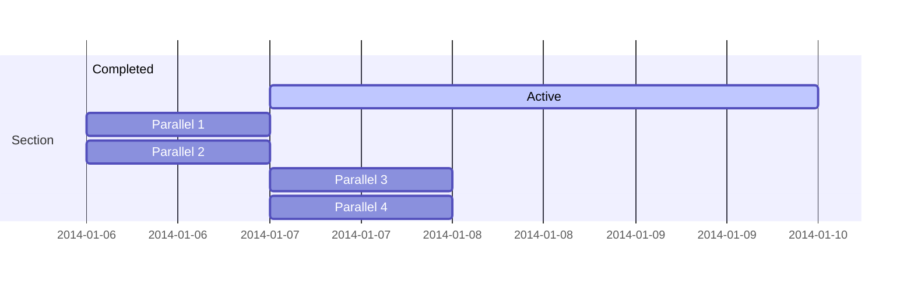
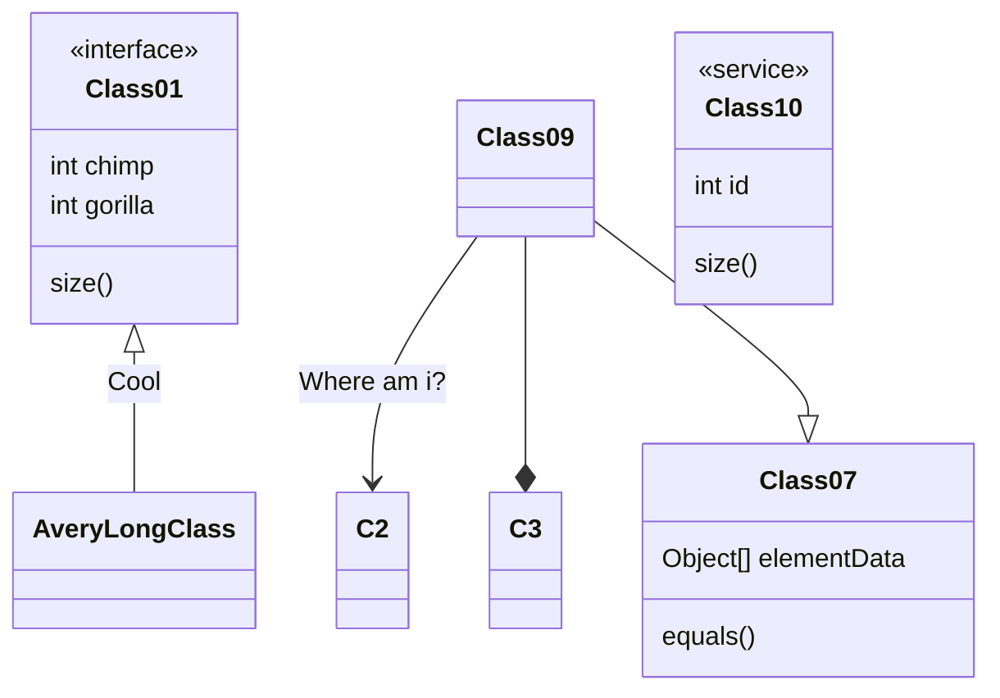
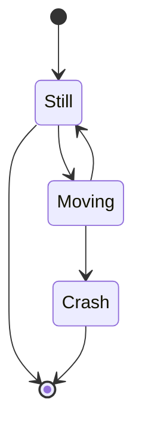

这是个样板文章，本网站基于Hugo和Academic构建
Hugo 是一个用 Go 编写的静态网站生成器，2013由 Steve Francia 原创，自 v0.14 (2015年) 由 Bjørn Erik Pedersen 主力开发[2]，并由全球各地的开发者和用户提交贡献。Hugo 以 Apache License 2.0 授权的开放源代码项目。[3]

Hugo 一般只需几秒钟就能生成一个网站（每页少于 1 毫秒），被称为“世界上最快的网站构建框架”，也使 Hugo 大受欢迎，成为最热门的静态网站生成器之一，被广泛采用。例如，2015年7月，Netlify 推出专为 Hugo 而设的网站托管服务[4]，而2017年，Smashing Magazine 推出重新设计的官方网站，从原来的 WordPress 迁移到基于 Hugo 的 JAMstack 解决方案。[5]

$$\gamma_{n} = \frac{ 
\left | \left (\mathbf x_{n} - \mathbf x_{n-1} \right )^T 
\left [\nabla F (\mathbf x_{n}) - \nabla F (\mathbf x_{n-1}) \right ] \right |}
{\left \|\nabla F(\mathbf{x}_{n}) - \nabla F(\mathbf{x}_{n-1}) \right \|^2}$$

An example flowchart:

An example sequence diagram:

An example Gantt diagram:

An example class diagram:

An example state diagram:

